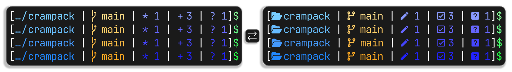

<div align="center">
  
  <h3>🎒 Crampack For <a href="https://starship.rs/">Starship 🚀</a></h1>
  <p style="text-align: center;">A clean, vivid prompt preset for Starship, rethinking the classic Linux/BSD/macOS default terminal prompt - but extended for modern workflows. It delivers high-contrast readability in a compact, vibrant layout, showing all the project info in comprehensive format. Provides four (project affection indicator) variants: Nerd Font icons, plain text, emoji, or full text.</p>
</div>

## 📦 Installation

1. Run the following command in terminal:
```shell
# For Windows (PowerShell)
irm "https://git.new/crampack-ps" | iex

# For Linux and macOS (Bash)
bash <(curl -fsSL "https://git.new/crampack-sh")
```

2. Select a prompted variant:
- 1: Standard (Nerd Font) — `crampack.toml`
- 2: Plain text (Unicode Symbols) — `crampack-plain-text.toml`
- 3: Emoji — `crampack-emoji.toml`
- 4: Full text — `crampack-full-text.toml`

3. Reload shell (don't needed actually) to see the result.

> [!TIP]
> (For PowerShell users) Sometimes you may not needed all the previous prompt information, so you can replace the previous-printed prompt with just `$` symbol. For setup see [Starship docs](https://starship.rs/advanced-config/#transientprompt-in-powershell).

## 🎨 Palettes

To change palette, edit `palette` key in `~/.config/starship.toml` to one of the following:
- `mellow`
- `lush`
- `fervor` 
- `blaze`

## 📚 Variants

<ul>
  <li>
  <strong>Standard</strong>: Nerd Font icons (e.g.:  for staged,  for modified,  for ahead).
  </li>
  <li>
  <strong>Plain text</strong>: ASCII/Unicode (e.g.: + for staged, * for modified, ↑ for ahead).
  </li>
  <li>
  <strong>Emoji</strong>: colorful emoji (e.g.: ✅ for staged, ✏️ for modified, ⬆️ for ahead).
  </li>
  <li>
  <strong>Full text</strong>: full Git state words (e.g.: staged, modified, ahead).
  </li>
</ul>

All include directory truncation, git branch/status, and vim support.

&nbsp;

<div align="center">
  
  <p>Made with 💜. Published under <a href="LICENSE">MIT license</a>.</p>
</div>
